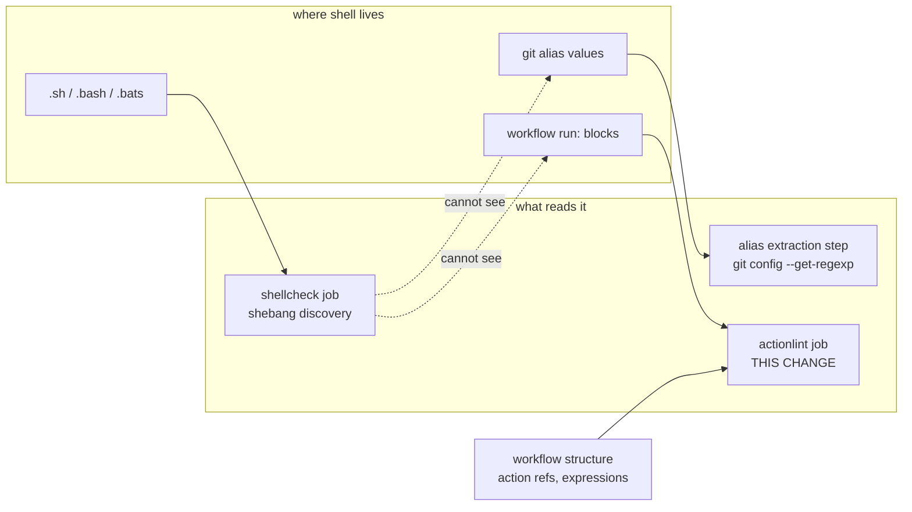

## Context

See [proposal.md — Why](proposal.md) for motivation.

The constraints that shape the approach:

- **`actionlint` is two tools in one.** It validates workflow structure — action references,
  expression syntax, event and matrix configuration — and it invokes ShellCheck on each `run:`
  block, passing the correct shell for the step.
- **There is one workflow file today**, `.github/workflows/ci.yml`, containing one `run:` block
  with real shell in it. Work already in flight adds more jobs and more `run:` blocks.
- **The validator runs inside the thing it validates.** A workflow broken badly enough not to
  parse never starts the job that would have reported it. This is a real ceiling on what the
  check can promise, not a defect to engineer away.
- **The repository has an established pattern for lint jobs**, set by the pending
  static-analysis work: one job per tool, on `ubuntu-latest`, with a pinned version and a
  distinct check name.

## What covers what

Each mechanism reaches exactly one region, because each region hides its shell differently — in
a file with a shebang, in a config value, in a YAML string. This change closes the third and
last one, and picks up workflow-structure validation on the way.

## Goals / Non-Goals

**Goals:**

- The workflow that runs every other check is itself checked.
- Shell inside `run:` blocks is analysed to the same standard as shell in a script.
- Discovery is automatic, so a second workflow file is covered on arrival.

**Non-Goals:**

- **Linting other YAML.** `mac-dev-setup` has a `.yamllint`; this repository's only YAML is its
  workflow, and `actionlint` understands workflows specifically. General YAML linting would add
  a tool for no additional coverage here.
- **Guaranteeing the workflow parses.** Structurally impossible from inside the workflow; see
  Risks.
- **Pinning action versions to digests.** A separate supply-chain concern, and `actionlint` does
  not require it.

## Decisions

### Its own job, named `actionlint`

Consistent with the pattern the pending static-analysis change establishes: one tool per job, so
the check name in the pull request tells you which tool objected without opening logs.

*Alternative considered:* a step inside the existing static-analysis job. It saves a runner
spin-up, and the argument for it is real — this is still "a linter finding a problem". Rejected
for the same reason that change rejected a combined `lint` job: the failure means something
different and is fixed by editing a different kind of file. A workflow error and an unquoted
expansion in a bats file have nothing to do with each other.

*Consequence:* four checks on a push, for a personal dotfiles repository. All are seconds long
and free on a public repository, so the cost is visual rather than real.

### Let `actionlint` own the ShellCheck invocation for `run:` blocks

`actionlint` already knows each step's shell, its implicit `set -e` behaviour, and which
variables the runner injects. Reimplementing extraction — the way the git-alias check must,
because git offers nothing equivalent — would be strictly worse here.

*Consequence:* two ShellCheck configurations exist, `actionlint`'s and the standalone job's, and
they can disagree about severity. Accepted: the alternative is not using the integration, which
would mean hand-rolling YAML extraction.

### Pin the version, as with the other linters

Same reasoning as the pending change: an unpinned linter that upgrades underneath you turns a
green branch red for reasons unrelated to the commit.

## Risks / Trade-offs

**The check cannot validate a workflow too broken to run** → If `ci.yml` fails to parse, GitHub
never starts the `actionlint` job, so the failure appears as "no checks ran" rather than as a
finding. Nothing inside the repository can close this. The mitigation is knowing it: the spec
records the limitation explicitly so a green result is not read as a stronger guarantee than it
is, and running the validator locally before pushing catches exactly this case.

**A fourth check on every push** → The pull request view gets busier for a repository maintained
by one person. The alternative is folding tools together and losing the named-check signal, which
was already weighed and rejected.

**Two ShellCheck configurations** → `actionlint`'s embedded invocation and the standalone job may
disagree on severity or suppressions. In practice they cover disjoint files, so a disagreement
shows up as inconsistent strictness rather than as conflicting verdicts on the same code.

**New findings on existing content** → The first run may object to the current workflow, most
likely in the fresh-machine `run:` block. Expected, and resolved like any other baseline: fix it,
or suppress with a stated reason.

## Migration Plan

No deployment and no runtime impact. Rollback is reverting the workflow edit.

This change is independent of the other work in flight — it applies to `.github/workflows/ci.yml`
as it stands today, and equally to whatever that file becomes.

## Open Questions

None.
