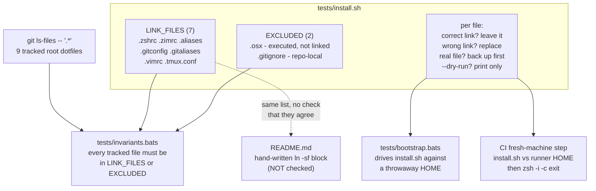

## Context

See [proposal.md](proposal.md) for motivation. What actually constrains this design:

- **The link list has three groups, not two.** Probing `git ls-files -- '.*' | grep -v '/'`
  returns nine tracked root dotfiles: seven that belong in `$HOME`, plus `.osx` (executed on
  demand, never linked) and `.gitignore` (applies to the repo itself). A naive
  "link everything tracked" rule would be wrong for two of the nine.
- **The drift check is already prototyped.** Cross-referencing that `git ls-files` output
  against a link list correctly flags `.tmux.conf` and correctly ignores `.gitignore` and
  `.osx`. It is roughly ten lines.
- **Every one of the seven is currently a live symlink** in this machine's `$HOME`, including
  `.tmux.conf`. So the installer must treat "correct link already present" as the common
  case, not the exception — on this machine a first run is effectively a no-op.
- **`.osx` is destructive**: `defaults write` plus `killall` of Dock, Finder, Mail.
- **CI runner `$HOME` is not empty.** The `macos-latest` image ships its own `.zshrc` and
  git config, so the fresh-machine step exercises the backup path, not the clean path.
- **`shellcheck` is installed and `.osx` passes it clean today**, so holding `install.sh` to
  zero findings costs nothing new.

### Architecture

The dotted edge is the known gap: `LINK_FILES` and the README's block are two copies of one
list, and only the left-hand copy is verified.

## Goals / Non-Goals

**Goals:**

- Make setup executable, therefore testable.
- Never destroy anything a user already had at a link target.
- Make the `.tmux.conf` class of mistake impossible to repeat silently.
- Keep the installer to one file with no dependencies beyond bash and coreutils.

**Non-Goals:**

- **Verifying the README.** Deliberate: the README's block stays hand-maintained. The
  coverage check protects `LINK_FILES`, not the prose.
- **Installing software.** No Homebrew, zimfw, fnm, or pnpm provisioning — the installer
  only creates symlinks. See Open Questions.
- **Running `.osx`.** It stays a manual, opt-in step exactly as it is today.
- **Uninstall.** Out of scope; the `.bak` files are the escape hatch.
- Anything the sibling `add-dotfiles-test-harness` change owns: syntax, tool-load, shell
  sandbox, alias sanity, and the base CI workflow.

## Decisions

### `LINK_FILES` plus an annotated exclusion list, both in the script

Two arrays in `tests/install.sh`: the seven to link, and the two to skip with the reason
written next to each. The coverage check reads both. Keeping them in the script rather than
a separate manifest means the thing that *does* the work and the thing that *declares* it
cannot disagree — a separate manifest would just recreate the README problem one level down.

*Alternative:* a `manifest.txt` consumed by both installer and README generator. Rejected
for now — it makes the README a build artifact, which is a bigger change than this warrants.

### Resolve the repo from `BASH_SOURCE`, never `$PWD`

`REPO_ROOT="$(cd "$(dirname "${BASH_SOURCE[0]}")/.." && pwd)"`. The script sits in `tests/`,
so it must climb one level. Using `$PWD` would silently create links pointing at wherever
the user happened to be standing.

### Four-state handling per target

| State at target | Action |
| --- | --- |
| nothing there | create link |
| symlink, resolves to the right repo file | leave it, report unchanged |
| symlink, resolves elsewhere | replace, report replaced |
| regular file or directory | move to `<name>.bak`, then link, report backup |

This is what makes the second run a genuine no-op and what makes the operation safe on a
machine that already has real config. `.bak` rather than a timestamped name keeps it
predictable; a pre-existing `.bak` is an error rather than a silent overwrite.

### `--dry-run` shares one code path with the real run

A single `run_or_echo` wrapper, not a parallel reporting branch. A dry run that computes its
plan differently from the real run is worse than no dry run, because it can be wrong in the
one direction that matters.

### Coverage check compares against `git ls-files`, not the filesystem

Untracked scratch files in the repo root must not fail the suite, and a tracked file that
was deleted from disk should. `git ls-files -- '.*' | grep -v '/'` is the right source.

### The fresh-machine CI step extends the sibling's workflow

One workflow file, one job, one runner. Splitting CI across two files would double the
provisioning cost for no gain.

## Risks / Trade-offs

**README and `LINK_FILES` still diverge** → The exact failure mode that motivated this work,
relocated rather than eliminated. Nothing checks the README. Mitigated only by the fact that
`LINK_FILES` is now authoritative for anything automated, and the README is one small block
a human can eyeball. The cheap future fix is replacing that block with `./tests/install.sh`.

**Backups accumulate silently** → Repeated setup on a machine with real config could leave
`.bak` files around. Treating an existing `.bak` as an error rather than overwriting means
the user is told rather than quietly losing a second-generation backup.

**CI's populated `$HOME` masks the clean path** → The runner already has a `.zshrc`, so the
fresh-machine step tests backup-and-link, not first-install. `tests/bootstrap.bats` must
cover the clean path explicitly against `mktemp -d`; CI alone is not sufficient coverage.

**Ordering dependency on the sibling change** → This change assumes `tests/Brewfile`,
`tests/helpers/common.bash`, and `.github/workflows/ci.yml` already exist. Landing this one
first means creating all three here instead. Stated in the proposal so the order is a
decision rather than a surprise.

**`invariants.bats` is touched by both changes** → The harness change creates it for the
alias check; this change adds the coverage check to it. If this lands first, it creates the
file instead. Either order works, but the two changes must not both assume they own the file.

**A symlink loop or unreadable target** → `readlink`-based comparison could misbehave on an
exotic filesystem. Acceptable: this is a personal dotfiles repo on macOS, and the tests run
against real directories.

## Migration Plan

No migration. On this machine the installer's first run should report all seven links
already correct and change nothing — that is itself a useful smoke test of the four-state
logic. Rollback is deleting `tests/install.sh` and its two test files and reverting the
README and workflow edits.

Order within the change: `install.sh` first, then the tests that drive it, then the CI step.

## Open Questions

- **Should the README's setup block become `./tests/install.sh`?** It would eliminate the
  divergence risk entirely. Partly settled during verification: the README now leads with
  `tests/install.sh` and keeps the hand-written block below it as the by-hand alternative.
  Deleting the block outright is still deferred — the divergence risk shrinks but remains.
- **A machine-provisioning Brewfile** (zimfw, fnm, pnpm, and the constraint that pnpm must
  come from Homebrew on this Intel Mac). Still unowned by either change. Would pair
  naturally with this installer if setup ever grows beyond symlinks.
