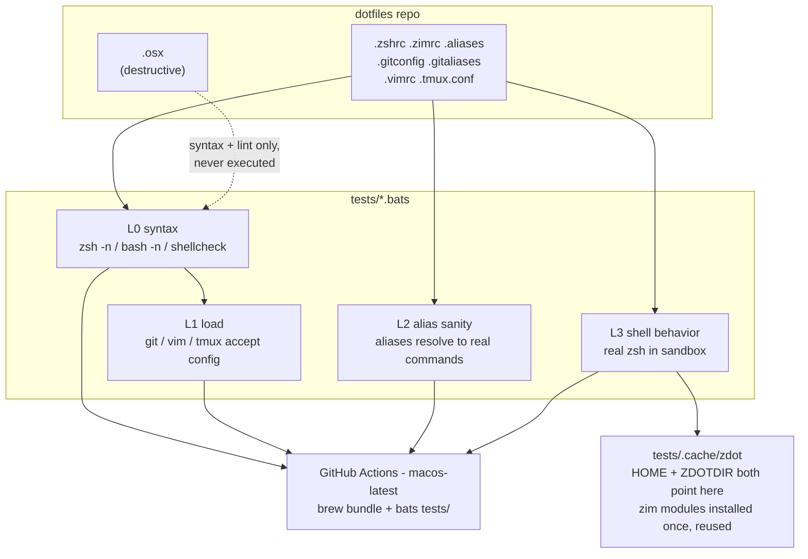

## Context

See [proposal.md](proposal.md) for motivation. The constraints that actually shape this
design, all confirmed by probing the repo rather than assumed:

- **Every cheap check already passes** with tooling installed on this machine. `zsh -n`,
  `bash -n`, `shellcheck .osx` (0 findings), `git config --file ... --list`,
  `vim -u .vimrc -es -c ':qa!'`, and loading `.tmux.conf` on a private socket all exit 0
  today. The suite starts from green.
- **`.zshrc` derives everything from `ZDOTDIR`.** `.zshrc:11-12` reads
  `HOME_DIR=${ZDOTDIR:-${HOME}}` then `ZIM_HOME=${HOME_DIR}/.zim`. This is the single most
  important fact in this design — it means the shell can be sandboxed with no production
  change at all.
- **`.zshrc` sources `~/.aliases` via `$HOME`, not `$ZDOTDIR`.** So a sandbox must set
  *both* variables, not just `ZDOTDIR`.
- **`shellcheck` does not support zsh.** Forcing `-s bash` on `.zshrc` produces false
  positives (it flags `source ${ZIM_HOME}/init.zsh` for word splitting, which is ordinary
  zsh). Linting must be language-matched.
- **The repo is public**, so macOS CI runners carry no minutes multiplier.
- **`.osx` is destructive**: it runs `defaults write` and `killall`s Dock, Finder, and Mail.
- Currently installed: `shellcheck`, `zsh 5.9`, `tmux 3.7c`, `vim 9.2`, `gh`.
  Absent: `bats`, `shfmt`, `docker`.

### Architecture

The layering is deliberate: L0-L2 need no isolation and run in well under a second, so they
fail fast on the common mistakes. L3 is the only layer that needs a sandbox.

## Goals / Non-Goals

**Goals:**

- Catch the regression classes named in the proposal before they reach a real shell.
- Sandbox the shell tests with **zero changes to any production dotfile**.
- Keep the dependency footprint to two Homebrew formulae.
- Make the suite runnable in one command locally and identically in CI.
- Stay standalone: this change must be landable and useful without the bootstrap change.

**Non-Goals:**

- **The installer and anything that tests it.** `install.sh`, the check that every tracked
  dotfile is covered by it, and the bootstrap tests all belong to the companion
  `add-dotfiles-bootstrap` change. Nothing here may reference an installer.
- **The README setup block.** This change only appends a Testing section. Fixing the
  `.tmux.conf` drift in the contents table and `ln -sf` list belongs to the bootstrap change.
  The dead `ggl` alias is the one exception pulled in here, because the alias-sanity check
  that catches it lives in this change and would otherwise land red.
- Executing or verifying `.osx`'s actual effects. Syntax and lint only, permanently.
- Testing `.zimrc` module *behavior*. Zim's own modules are upstream's responsibility; the
  suite only asserts that startup succeeds and the environment comes out right.
- Cross-platform support. This is a macOS dotfiles repo.
- A machine-provisioning Brewfile (zimfw, fnm, pnpm). See Open Questions.

## Decisions

### Use bats-core as the runner

CLAUDE.md states a preference for a well-tested library over hand-rolling, and a test
runner is exactly the kind of thing not worth owning. `bats-core` is the de facto standard
for shell testing and installs from Homebrew in one line.

*Alternatives:* A hand-rolled `tests/run.sh` needs no dependency and runs anywhere, but
contradicts the stated preference and means owning assertion and reporting code. `pytest`
has better assertions and the machine has `python3`, but it would make a shell-configuration
repo depend on a Python toolchain to test itself — inverting the dependency story for no
gain. `zunit` is natively zsh but is effectively unmaintained.

Bats being written in bash is not an obstacle: it is the harness, not the shell under test.
zsh assertions are simply `run zsh -c '...'`.

### Start without bats-support / bats-assert

Plain `run` plus `$status` and `$output` covers every assertion this suite needs, and keeps
the dependency count at one. The helper libraries are normally vendored as git submodules,
which is real ongoing cost for syntactic sugar. Revisit only if assertions get verbose.

### Sandbox the shell with ZDOTDIR + HOME, over a persistent cache

Setting both `HOME` and `ZDOTDIR` at `tests/.cache/zdot` (with `.zshrc`, `.zimrc`, and
`.aliases` symlinked in) gives complete isolation for free, because `.zshrc` already derives
`ZIM_HOME` and its `~/.aliases` lookup from those two variables.

Making the cache **persistent and gitignored** rather than a fresh temp dir each run is the
key performance decision. A fresh `ZIM_HOME` triggers `zimfw init`, which downloads every
module in `.zimrc` from GitHub — roughly ten seconds and a hard network dependency on every
single run. Persisting it means that cost is paid once locally, and once per cache key in
CI (`actions/cache` keyed on `hashFiles('.zimrc')`, which is exactly right: new modules
should invalidate it).

*Alternatives considered and rejected:*

| Approach | Why not |
| --- | --- |
| Test-mode env guard inside `.zshrc` | Puts test awareness into the artifact under test. The thing being verified should not know it is being verified. |
| Split PATH logic into a separate sourceable file | Restructures `.zshrc` to serve the tests. Largest blast radius of the four, for no behavior gain. |
| Fresh temp `ZIM_HOME` per run | Correct but ~10s and network-dependent per run. Kills the fast-feedback loop. |
| Docker | Not installed, and `brew --prefix`, `osxkeychain`, and `defaults` are macOS-only anyway. |

### Language-matched checking

`zsh -n` for `.zshrc`, `.aliases`, `.zimrc`. `bash -n` plus `shellcheck` for `.osx`, which
is the only bash script in this change's scope. Never `shellcheck` a zsh file — see Context.

### Isolate tmux with a private socket

`tmux -L "bats-$$" -f .tmux.conf new-session -d`, with `teardown()` running
`tmux -L "bats-$$" kill-server`. The `-L` flag gives the test its own socket, so a tmux
session the user is sitting in is untouched. tmux has no parse-only mode, so actually
starting a server is the only real check available.

### `tests/Brewfile` is the tooling manifest for both CI and local

One manifest means CI and a developer machine install the same tooling with the same
command, and adding a future test dependency is a one-line change in one place.

## Risks / Trade-offs

**CI runners are ARM, this machine is Intel** → `macos-latest` is Apple Silicon, so
`brew --prefix` resolves to `/opt/homebrew` there and `/usr/local` here. `.zshrc` already
uses `$(brew --prefix)` rather than a hardcoded path, so this is a *feature*: CI will catch
any future `/usr/local` assumption before it ships. Risk is limited to a formula behaving
differently across architectures.

**Zim module download makes L3 slow or flaky** → Persistent cache locally, `actions/cache`
in CI. Worst case is a cold cache costing one slow run, not a failure.

**The alias-target check is machine-dependent** → `v=vagrant` resolves here but not on a
runner. Guard with bats' `skip` when `$CI` is set, per the spec's requirement on
machine-dependent checks. The check keeps its value locally, where it is the thing that
catches a dead alias like `ggl=google`.

**`.osx` gets executed by accident** → Never referenced by any run target; only ever passed
as an argument to `bash -n` and `shellcheck`. Called out in the spec as a requirement so it
survives future edits.

**Bats is a new dependency on a fresh machine** → `tests/Brewfile` makes it one command, and
the README's Testing section names it. Layers 0-2 would still be runnable by hand if bats
were unavailable.

**The suite passes while setup is still broken** → This change verifies the dotfiles, not
the path by which they reach a machine. A green suite says nothing about whether the README
or an installer is correct — that gap is exactly what `add-dotfiles-bootstrap` closes, and
until it lands the gap is real and known.

## Migration Plan

No migration. Nothing existing changes behavior — the additions are new files plus two
additive edits (`.gitignore`, and a new README section). Rollback is deleting `tests/` and
`.github/` and reverting those two.

No ordering constraints inside this change beyond the obvious: `tests/Brewfile` and
`tests/helpers/common.bash` come before the `.bats` files that use them, and the sandbox
helper comes before `shell.bats`.

## Open Questions

- **A machine-provisioning Brewfile.** The knowledge that pnpm must come from Homebrew on
  this Intel Mac (and that `pnpm self-update` corrupts it), and that fnm owns Node, lives
  outside this repo today. Capturing it in a root `Brewfile` would be valuable, but it is a
  separate capability from verification and does not change any spec, decision, or task
  here. Deferred deliberately.
- **Whether `.claude/` and `openspec/` should be tracked.** Currently untracked and out of
  scope for this change.
