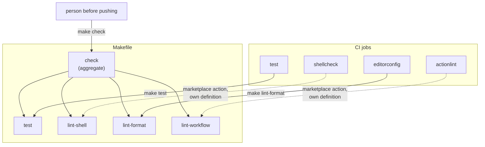

## Context

See [proposal.md — Why](proposal.md) for motivation.

The constraints that shape the approach:

- **The checks are not all the same shape.** The behavioural suite needs macOS and Homebrew
  tooling. The linters run anywhere. A single target that runs everything will therefore behave
  differently on a Mac than on a Linux machine, and only the Mac case is complete.
- **CI already provisions differently per job.** The behavioural job installs from
  `tests/Brewfile`; the lint jobs fetch pinned tools directly. Targets must not assume one
  provisioning story.
- **`make` is present on macOS without installation**, which matters for a repository whose
  point is setting up a machine that may have nothing on it yet.
- **`mac-dev-setup` already uses a `Makefile`** as its entry point, so this is adopting a
  convention rather than inventing one.
- **The target list depends on work in flight.** The checks this wraps are defined by other
  changes not yet applied.

## One definition, two callers

Solid edges are calls: the job runs the target, so the check is defined once and neither side
holds a copy. Dashed edges are not calls — the `shellcheck` and `actionlint` jobs run pinned
marketplace actions that install and check in one step, so each holds its own definition and the
target only mirrors it. Two of the four checks are shared by construction; for the other two,
`lint-shell` and `lint-workflow` are local-only entry points whose agreement rests on matching
how the action selects its inputs.

## Goals / Non-Goals

**Goals:**

- One command establishes locally what CI would conclude.
- Each check remains runnable alone, for iterating on one set of findings.
- Adding a check means editing one place, and both callers get it.
- The entry point is discoverable without reading the `Makefile`.

**Non-Goals:**

- **Replacing `bats` or any linter.** The targets are a thin wrapper; the tools are unchanged.
- **Installing tooling.** A target that runs `brew bundle` on its own would make a check mutate
  the machine. Provisioning stays a separate, explicit step.
- **Making the linters run on macOS in CI.** The jobs keep their runners; only the command they
  invoke changes.
- **A general task runner.** No targets for building, releasing, or installing dotfiles. The
  installer stays its own script.

## Decisions

### `make`, not a shell script or `just`

`make` is already on every Mac, needs no installation on a machine that may have nothing yet,
and is what the sibling repository uses. Consistency across the pair is worth more here than any
feature a newer runner offers.

*Alternative considered:* `just`, which has cleaner semantics and no tab sensitivity. Rejected —
it is a Homebrew install away on a repository whose whole purpose is bootstrapping a machine
from nothing, and it would make the two repositories disagree.

*Alternative considered:* a `scripts/check.sh`. Rejected — it reimplements target selection and
dependency ordering that `make` already has, and gives up the per-check invocation for free.

### CI jobs call targets rather than spelling out commands

This is what makes the local command trustworthy. If a job runs `shellcheck` with flags the
`Makefile` does not use, a clean local run proves nothing. Having each job invoke its target
makes the definitions shared by construction rather than by discipline.

*Alternative considered:* leave CI as it is and have the `Makefile` mirror it. Rejected — that is
exactly the drift the change exists to prevent, and nothing would detect it.

*Consequence:* the jobs get slightly less readable, since the commands move out of the workflow
into the `Makefile`. Worth it, and `make -n` shows what a target would run.

*Scope:* this holds for the two jobs with a separable command — `test` and `editorconfig`. See
the next decision for the other two.

### Two jobs keep their marketplace actions

`shellcheck` and `actionlint` run through actions that install a pinned version and check in one
atomic step; neither offers an install-only mode, so pointing them at a target means replacing
the action outright and giving up its pinning. They are left as they are, which makes `lint-shell`
and `lint-workflow` local-only entry points.

*Consequence:* for those two, a clean local run rests on the target matching the action rather
than on invoking it, and nothing detects a divergence. `lint-shell` narrows that exposure by
discovering its inputs — `git ls-files` over the same patterns the action finds — so neither side
carries a hand-written file list that can fall out of date. An enumerated list had already
drifted: it omitted `tests/lint-gitaliases.sh`, which the action checks by pattern.

*Alternative considered:* replace both actions with an install step plus `make`. Rejected for
now — it gives up pinned versions and the actions' caching for a gain that only matters once the
definitions actually diverge.

### The aggregate target is honest about what it covers

On a machine without the macOS tooling the behavioural suite cannot run. The aggregate reports
that part as skipped, with a reason, rather than failing or silently omitting it.

*Alternative considered:* make the aggregate fail when tooling is missing. Rejected — it turns a
first run on a fresh machine into an error about the tool rather than about the code, which is
the opposite of a useful entry point.

### Targets do not install anything

A check that installs software is no longer a check. `brew bundle --file=tests/Brewfile` stays a
separate step, named in the README next to the aggregate, so the person runs it once knowingly.

## Risks / Trade-offs

**The target list falls behind the checks** → The failure is quiet: the aggregate passes while CI
fails, which is precisely the problem this change set out to fix, reintroduced one level up. The
structural mitigation is that CI jobs call the targets, so a check with no target has nothing to
invoke and is noticed immediately. That mitigation covers `test` and `editorconfig` only. For
`shellcheck` and `actionlint` the target can still fall behind the action, which is why
`lint-shell` derives its file set rather than listing it.

**Local and CI results can still differ** → Tool versions differ between a Homebrew install and a
pinned CI version, and the linters run on Linux in CI and macOS locally. Two checks' CI
definitions also live in the workflow rather than the `Makefile`. Shared commands remove one
source of difference, not all of them. The README should say the aggregate is a strong signal
rather than a guarantee, and name which checks are only matched.

**`make`'s tab sensitivity** → A recipe indented with spaces fails confusingly. The
`.editorconfig` from the formatting change needs a `Makefile` section preserving tabs, or the
formatting check and the `Makefile` will fight each other.

**Ordering against other changes** → Written against a target list that does not fully exist yet.
Applying this before the changes that define those checks would produce targets invoking commands
that are not wired up.

## Migration Plan

No deployment. The `Makefile` is additive; nothing depends on it until the CI jobs are pointed at
it, which happens in the same change.

Ordering: apply after the changes that create the checks being wrapped. If any of those is not
applied, its target and the corresponding job edit are left out and added when it lands.

Rollback is deleting the `Makefile` and restoring the inline commands in the workflow.

## Open Questions

None.
