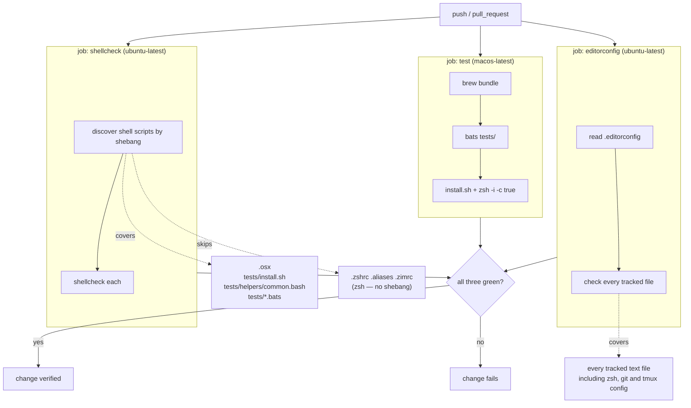

## Context

See [proposal.md — Why](proposal.md) for motivation.

The constraints that shape the approach:

- **Two shell languages, one analyser.** `.zshrc`, `.aliases`, and `.zimrc` are zsh. ShellCheck
  cannot read zsh and never should be pointed at it. The bash-family files are `.osx`,
  `tests/install.sh`, `tests/helpers/common.bash`, and five `.bats` files.
- **The zsh files have no shebang and no extension.** Discovery that keys on shebangs skips
  them for free; discovery that keys on filename patterns does not.
- **`.osx` has no extension either**, but does have `#!/usr/bin/env bash`. So shebang-based
  discovery is the mechanism that gets both cases right by default.
- **`.bats` files use `#!/usr/bin/env bats`**, which is not a shell name. ShellCheck itself
  handles them — verified locally, it analyses the file rather than skipping it — but whether a
  discovery layer classifies `bats` as a shell is the one genuine unknown here.
- **Current ShellCheck baseline is three findings**, all `SC2016`, all in `tests/shell.bats`
  (lines 26, 33, 41). Every other file is clean today.
- **Current formatting baseline** is four files with no final newline (`.gitconfig`,
  `.gitaliases`, `.tmux.conf`, `.osx`), zero tabs anywhere, zero trailing whitespace, and one
  file — `.zshrc` — that mixes two-space and four-space indentation internally.
- **Three editors, three levels of support.** JetBrains reads `.editorconfig` natively. VS Code
  reads it only with the EditorConfig extension installed. Vim reads it only with a plugin, and
  `.vimrc` loads no plugin manager at all.
- The existing CI job takes 25 seconds end to end, of which 8 is `brew bundle` and 6 is `bats`.

## CI shape

The three jobs are independent and run in parallel. None is a prerequisite of another; the
change is verified only when all three pass.

Note where the two linters' coverage differs. ShellCheck is deep but narrow — it understands
bash semantics and reads only bash. `editorconfig-checker` is shallow but total — it understands
nothing about any language and reads everything. The four files that motivated the formatting
half of this change are git and tmux config, which is precisely the region ShellCheck can never
reach.

## Goals / Non-Goals

**Goals:**

- Discovery is automatic for both checks, so a file added later is covered without anyone
  registering it.
- `.bats` files are analysed. This is the specific gap that motivated the change.
- A deliberate suppression is distinguishable from an oversight, by carrying a reason.
- The failing part is legible from the check name alone.
- The formatting conventions live in one declaration that all three editors can be made to
  follow, rather than three editor-specific configurations that drift.

**Non-Goals:**

- **Autoformatting.** `shfmt` rewrites code; nothing here does. Enforcement fails the build and
  tells you what to fix. `shfmt` was considered and rejected — see Decisions.
- **Any zsh linting.** No zsh linter exists. `zsh -n` remains the ceiling for those files and
  stays where it is, in `tests/syntax.bats`.
- **Restoring exact local/CI parity.** Separate jobs knowingly give that up; see Risks.
- **Changing what the behavioural suite covers.** Only the `.osx` shellcheck test moves.
- **Enforcing line length.** The repository has no line-length convention and inventing one
  would create churn in files that are fine as they are.

## Decisions

### Run both linters on `ubuntu-latest`, not `macos-latest`

Neither ShellCheck nor `editorconfig-checker` reads anything macOS-specific. Ubuntu runners
start faster, queue shorter, and ship or fetch these tools without a provisioning step.

*Alternative considered:* run them on `macos-latest` for symmetry with the existing job and
reuse `tests/Brewfile`. Rejected — it buys nothing but spends the 8-second provisioning step on
tools that do not care what OS they run on.

*Consequence:* the tool versions in CI are decoupled from those in `tests/Brewfile`. See Risks.

### Two separate lint jobs, not one combined `lint` job

`shellcheck` and `editorconfig` fail for unrelated reasons and are fixed by unrelated edits.
Separate jobs give each its own named check, which is the whole reason this change chose
separate jobs over bats tests in the first place. Ubuntu runners are free on a public repository
and both jobs finish in well under a minute, so the extra runner costs nothing that matters.

*Alternative considered:* one `lint` job with two steps. It halves runner spin-up and keeps the
workflow shorter, and a failing step is still visible in the GitHub UI without opening logs.
Rejected because a combined job reports as one red check named `lint`, which is a weaker signal
than the one the specs ask for, and because the two checks have no reason to share a lifecycle.

### Discover shell scripts by shebang, using an off-the-shelf action

`ludeeus/action-shellcheck` walks the tree and identifies shell scripts by shebang and
extension. That is exactly the discovery logic this change would otherwise hand-roll, and the
repository's conventions favour a well-tested dependency over owning the code.

Shebang-based discovery is also the mechanism that gets this repository's two awkward cases
right without configuration: `.osx` is found despite having no extension, and the three zsh
files are skipped despite sitting at the repository root.

*Alternative considered:* enumerating tracked files with git and routing them by language.
Roughly eight lines, mirroring the enumeration already in `invariants.bats:57`. It is
*stricter* — it would catch a tracked script missing its shebang, which shebang-discovery
silently skips. Rejected for this change because it is code to own and maintain, but it remains
the fallback if the action cannot be made to cover `.bats` files.

### Keep ShellCheck's default severity

The default reports `info`-level findings, which is where `SC2086` (unquoted expansion) lives —
one of the more valuable checks for a script that manipulates paths in `$HOME`. Raising the
threshold to `warning` to make the current three findings disappear would also switch off
`SC2086` everywhere, which inverts the point of the change.

*Alternative considered:* `severity: warning`. Rejected — it would silence the baseline by
lowering the bar rather than by deciding about it.

### Suppress the three `SC2016` findings per-line, with a reason

The findings are correct about the syntax and wrong about the intent. In
`sandboxed_zsh 'echo $PNPM_HOME'` the single quotes are load-bearing: the string must arrive at
the sandboxed shell unexpanded so that *that* shell resolves the variable. Double-quoting would
interpolate the bats process's own environment, and the assertion would compare two values that
both came from the wrong place — passing while testing nothing.

Per-line `# shellcheck disable=SC2016` directives with a comment stating the above, rather than
one file-level directive, so that a genuine `SC2016` introduced later still fails.

*Alternative considered:* a file-level directive at the top of `tests/shell.bats`. Rejected —
it blankets the whole file forever, including code not yet written.

### Remove the `.osx passes shellcheck` test from `tests/syntax.bats`

`.osx` is covered by the new job. Keeping both would mean one file linted twice through two
different discovery mechanisms that can drift apart — the failure mode this change exists to
eliminate. `tests/syntax.bats` keeps only parse checks, which matches its header comment and its
name.

### Declare conventions per file type, not one width repository-wide

The bash and bats files are two-space; `.gitconfig`, `.gitaliases`, and `.vimrc` are four-space.
Both are the normal convention for their kind, and flattening them to one width would rewrite
files that are not wrong. `.editorconfig` sections express this directly.

The repository-wide settings are the ones that are genuinely universal: spaces rather than tabs,
a final newline, no trailing whitespace, UTF-8.

*Note:* `editorconfig-checker` enforces indent *style* reliably but treats indent *size* as
advisory, because continuation lines and aligned blocks legitimately break a fixed width. So
`indent_size` here documents intent for the editors and is not expected to be a build gate. The
`.zshrc` internal mix is therefore fixed by hand in this change rather than caught by the tool.

### Configure vim directly rather than adding a plugin manager

Vim is the only one of the three editors with no path to `.editorconfig` short of installing a
plugin, and `.vimrc` currently loads no plugin manager at all. Adding vim-plug plus
`editorconfig-vim` to make one config file readable is a large dependency for a small result.

`.vimrc` is itself a tracked file in this repository, so the conventions can simply be written
into it: `expandtab`, an explicit width, and a `FileType` autocommand narrowing shell files to
two. The declaration and the editor then agree, which is what the spec asks for; they just agree
by duplication rather than by reference.

*Alternative considered:* add a plugin manager and `editorconfig-vim`, making `.editorconfig`
the single source for all three editors. Worth revisiting if `.vimrc` ever grows a plugin
manager for other reasons — at that point the duplicated settings should be deleted in favour of
the plugin.

*Consequence:* the conventions are stated in two places and can drift. The CI job is what makes
that safe: if they drift, the build fails rather than the repository silently reformatting.

### Do not adopt `shfmt`

`shfmt` autoformats bash. It was considered as part of this change and rejected on coverage: of
the four files with a formatting defect today, `shfmt` reaches exactly one (`.osx`). The other
three are git and tmux config. It also cannot read the zsh files, where the one real indentation
inconsistency actually lives.

Adopting it would additionally mean a repository-wide reformat commit that pollutes blame
history, which in turn wants an ignore-revs file and a matching setting in `.gitconfig` — three
tracked-file changes riding along to fix one newline.

*Alternative considered:* `shfmt -d` in CI as a check rather than a formatter. Same coverage
problem, and it would still impose `shfmt`'s house style on brace placement and `case`
indentation. Revisit if the repository grows substantially more bash.

## Risks / Trade-offs

**The action may not classify `#!/usr/bin/env bats` as a shell script** → This would defeat the
change's main purpose, so it is settled during implementation before anything else, not
afterwards. The action exposes an input for additional file patterns; if that covers `.bats`,
use it. If neither shebang detection nor an explicit pattern works, fall back to the git-based
enumeration described under Decisions. Verify the input names against the action's own
documentation rather than assuming them.

**Tool version drift between local Homebrew and CI** → A newer ShellCheck or
`editorconfig-checker` reports findings an older one does not, producing "clean locally, red in
CI" for reasons unrelated to the change being made. Pin both versions explicitly in the workflow
rather than accepting whatever the runner provides, so upgrades are a deliberate commit.

**`bats tests/` no longer means "everything passes"** → This is the accepted cost of separate
jobs and cannot be fully mitigated, only documented. The README's Testing section must state
that verification has three parts and give the command for each. Those commands approximate CI
discovery rather than reproducing it, which is itself a small drift risk.

**Discovery is silent about what it skipped** → A script that loses its shebang stops being
analysed and nothing says so. The git-based enumeration does not have this weakness. If this
bites, that fallback is the answer.

**`editorconfig-checker` may object to files this change does not intend to govern** → The
`openspec/` artifacts, `README.md`, and `.github/` YAML all come into scope the moment the tool
runs. The first full run is expected to surface findings beyond the four known files; each is
either fixed or excluded deliberately via the tool's ignore configuration, with the exclusion
list kept short and reasoned.

**Whitespace-only edits to installed dotfiles** → `.gitconfig`, `.gitaliases`, `.tmux.conf`, and
`.osx` are symlinked into a live `$HOME`. The edits are whitespace-only, but they are edits to
files in active use. The behavioural suite already covers git config parsing, tmux config
loading, and `.osx` syntax, so a mistake here fails a test rather than surfacing later in a
terminal.

## Migration Plan

No deployment and no runtime impact — this repository's "production" is the author's own
machine, and no installed dotfile changes behaviour. Rollback is reverting the workflow edit and
the whitespace commits.

Two ordering constraints:

1. The three `SC2016` suppressions must land before or with the `shellcheck` job, or that job is
   red the moment it is added.
2. `.editorconfig` and the four newline fixes must land before or with the `editorconfig` job,
   for the same reason.

## Open Questions

None that can be deferred. The `.bats` discovery question is load-bearing and is resolved as the
first implementation task.
