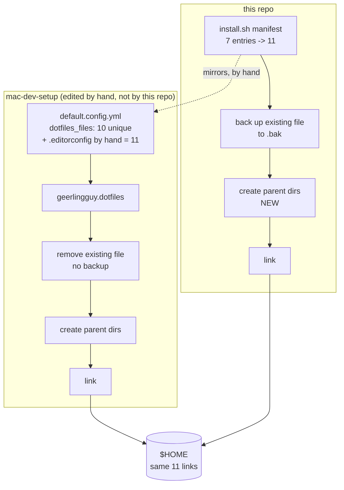

## Context

See [proposal.md — Why](proposal.md) for motivation.

The constraints that shape the approach:

- **The Ansible repository is not edited by this repository.** Whatever alignment happens here,
  this repository does it. One manual edit over there is required and is called out rather than
  automated — see Decisions.
- **The external installer is `geerlingguy.dotfiles`**, driven by `dotfiles_files` in
  `mac-dev-setup/default.config.yml`. Read directly: eleven entries, ten unique
  (`.claude/CLAUDE.md` appears twice, at lines 16 and 25). `config.yml` overrides only
  `dotfiles_repo` and `dotfiles_repo_local_destination`, not the list.
- **This repository's current list is a strict subset of that one.** All seven entries in
  `LINK_FILES` appear in `dotfiles_files`. Alignment of the shared files is therefore purely
  additive: three to add, nothing to remove or rename. `.editorconfig` is the one addition that
  goes the other way, and it is the reason the manual Ansible edit exists.
- **The role links `<repo>/<item>` to `~/<item>`.** A managed dotfile's path inside the
  repository is therefore its path inside `$HOME`. Nothing can be relocated into a tidy
  subdirectory without changing where it lands.
- **The tracked inventory is small and fully enumerable.** Twelve dotfiles after this change,
  eleven of them linked.
- **The two installers have opposite semantics on a pre-existing real file.** `install.sh` backs
  it up to `<name>.bak` and refuses to clobber an existing backup. The Ansible role removes it
  outright (`state: absent`) before linking. See Decisions.
- **The Ansible role already solves nested paths**, with an explicit step that ensures the parent
  directory of each link exists before linking. `install.sh` has no equivalent.
- **`dotfiles_repo_local_destination` defaults to `~/.dotfiles`**, but `config.yml` overrides it
  to `~/Projects/dotfiles`, and no `~/.dotfiles` exists. Both installers operate on the same
  checkout.

## The two install paths

The dotted edge is the whole design problem. The two manifests must agree, and after this change
nothing checks that they do — see Decisions.

## Goals / Non-Goals

**Goals:**

- A standalone clone plus one command yields the same links as a full Ansible provision.
- The installer is discoverable as an installer.
- Adding or removing a dotfile costs one edit, in one place.

**Non-Goals:**

- **Editing `mac-dev-setup` from here.** The one required change is handed to the user, including
  the duplicate `.claude/CLAUDE.md` entry, which is harmless and stays.
- **Making the standalone path install software.** Homebrew packages, `zimfw`, `fnm`, `rbenv`,
  and the casks are declared in `homebrew_installed_packages` in the Ansible repository, and that
  stays the only place they are declared. "Same `$HOME`" here means the same links, not the same
  machine.
- **Automated drift detection between the two repositories.** Considered and rejected — see
  Decisions.
- **Reconciling the backup-versus-delete difference.** Also a decision, below.
- **Verifying that the manifest is complete.** Deliberately given up — see Decisions.

## Decisions

### The installer moves to the repository root as `install.sh`

A standalone user clones the repository and needs to find the thing that installs it. `tests/` is
where the test suite lives, and the README currently sends new machines into it, which reads as a
mistake even though it works.

*Alternative considered:* `bin/install` or `script/bootstrap`, following the "scripts to rule them
all" convention. Rejected as premature — that convention earns its keep when there are several
scripts with a shared entry-point discipline. There is one script.

*Consequence:* the path references in `README.md`, `tests/invariants.bats`,
`.github/workflows/ci.yml`, and `tests/bootstrap.bats` all move. `REPO_ROOT` inside the script
also loses its `/..`, which is easy to miss and breaks every link if missed.

### The manifest mirrors `dotfiles_files`, and nothing enforces or annotates it

The manifest is ordered to match `dotfiles_files` so the two compare line by line, but carries no
comment saying so. Keeping them in step is a manual act, and the coupling is documented here
rather than in the script.

*Alternative considered:* a comment above the manifest naming
`mac-dev-setup/default.config.yml`, so the coupling is discoverable from the file that depends on
it. Rejected on the author's call — the manifest is a list of filenames and reads as one, and a
three-line preamble about a second repository is noise at the point of use for a fact that
changes only when the playbook does.

*Alternative considered:* a CI job that fetches the Ansible repository's `default.config.yml` and
fails when the two lists disagree. It would catch drift the day it happens, and reading that repo
does not violate the not-in-scope constraint. Rejected deliberately: it makes this repository's CI
fail because of a commit in a different repository, which is a confusing signal for a personal
dotfiles repo, and it introduces a network dependency into a check that otherwise needs none.

*Consequence:* the two lists will drift eventually, and the spec says so plainly rather than
pretending otherwise. The mitigation is that divergence is cheap to detect by hand — both lists are
about ten lines — and cheap to fix.

### `.gitignore` is installed, and the old reason for excluding it was wrong

`.gitconfig` sets `excludesfile = ~/.gitignore`. That is git's global ignore file, not a
repository-local one. The existing exclusion reason — "applies to the repository itself" — reads
the filename rather than the configuration that points at it.

The failure mode this creates is the quiet kind: git does not warn about a missing excludes file,
it just behaves as though the file were empty. A standalone install would produce a machine where
global ignore rules silently do nothing, and nothing in the test suite would notice, because no
test asserts that global ignores work.

*Alternative considered:* keep the exclusion and drop `excludesfile` from `.gitconfig` instead.
Rejected — it removes a working feature to preserve a mistaken exclusion, and diverges further
from the Ansible path rather than converging.

*Known wrinkle:* the file is genuinely dual-purpose, and some of its patterns (`tests/.cache/`,
`**/.claude/commands/opsx/`) are specific to this repository yet apply globally once linked. This
is already the live state and is not made worse here, so it is recorded rather than fixed.

### `.osx` is linked but still never executed

Linking a script into `$HOME` and running it are unrelated acts. The existing prohibition —
"System-mutating scripts stay untouched" — is about execution, and it is untouched by this change.
Ansible links `.osx`, so converging means linking it too.

The spec gains an explicit scenario for this, because "the macOS defaults script is linked" and
"the macOS defaults script is never run" sitting in the same document looks like a contradiction
until it is spelled out.

### `.editorconfig` is linked rather than relocated, because it cannot be relocated

The EditorConfig specification fixes the filename as `.editorconfig`, and the lookup walks upward
from the file being checked, stopping at the first file declaring `root = true`. A copy under
`tests/` would govern only `tests/`. `editorconfig-checker` never sets the core library's `Name`
field, so there is no override; and deleting the file is worse than it looks, because the tool has
no built-in defaults — every check reads its expectation from the declaration and no-ops when it
is absent. The formatting job would pass on anything.

So the file has to sit at the top of the repository. Given that, the choice is between an
explained exception and making it genuinely belong there. Linking it is the second: it keeps
governing this repository — its own `root = true` is found first, so the home-directory copy never
enters the search for files inside the repo — and becomes the default for projects that do not
declare their own.

There is a real benefit beyond tidiness. The existing `indent_size` blocks for `.gitconfig`,
`.gitaliases`, `.vimrc`, and `.osx` currently stop at the repository boundary. Once linked, they
apply to those same files in `$HOME`, which is where they are actually edited.

*Alternative considered:* moving every managed dotfile into a `home/` subdirectory, leaving only
repository tooling at the top. This would end the ambiguity permanently. Rejected: the Ansible role
links `<repo>/<item>` to `~/<item>`, so `home/.zshrc` would land at `~/home/.zshrc`. It cannot work
without replacing the role.

*Consequence:* `dotfiles_files` must gain `.editorconfig` by hand, or the routes differ by one
file. Until then the standalone route links one more file than Ansible does — a temporary,
one-directional divergence with no failure mode beyond the file being absent.

### The global declaration gains tab rules before it is linked

`[*] indent_style = space` is correct for this repository and wrong as a universal default:
Makefiles require literal tabs, and Go is tab-indented by convention. Sections for both are added
before the file is linked, so serving as a global default cannot corrupt them.

This costs a few lines describing formats this repository does not contain. That is the price of
the file being global, and it is cheaper than discovering the problem inside a broken Makefile.
It also pre-empts task 3.1 of the pending `add-make-check-entry-point` change, which planned to
add the same `Makefile` section for that change's own Makefile.

### The accounting check is removed rather than widened

The original plan widened the check to cover subdirectories. It is removed instead.

The check required every tracked dotfile to appear in either `LINK_FILES` or a parallel
`EXCLUDED_FILES`/`EXCLUDED_REASONS` pair. Adding a dotfile you did not want linked meant adding two
array entries whose only consumer was the check itself. For a personal dotfiles repository, that is
friction on the most routine act there is.

*What is given up:* nothing will now report a dotfile that is tracked but never linked — which is
exactly how `.claude/CLAUDE.md` went unnoticed. That is a real reduction in safety, accepted
knowingly rather than argued away.

*What is kept:* the written reasons, as a comment beside the manifest. They earned it — this entire
change began by reading one of those reasons and finding it wrong. The arrays did not.

*Consequence:* the exclusion arrays disappear, and with them the bash 3.2 `declare -A` note that
justified their shape.

### The installer can print its own list

`tests/bootstrap.bats` hard-codes the seven managed files, and `tests/invariants.bats` extracts
them from the script's source with `sed` and `grep -oE '\.[A-Za-z0-9_.-]+'`. That regex stops at a
slash, so `.claude/CLAUDE.md` would be read as `.claude` plus `.md` — the extraction was going to
break on the very entry this change adds.

A `--list` flag replaces both. The tests ask the installer what it manages instead of parsing it,
which removes the coupling to the script's text and the risk of a silently empty extraction.

*Consequence:* `bootstrap.bats` asserts that the installer links what it declares, not that the
declaration is correct. With the accounting check gone, nothing checks the declaration. That is
the same trade as above, stated where it bites.

### The backup-versus-delete difference stays

`install.sh` preserves a pre-existing real file as `<name>.bak`; the Ansible role deletes it. The
`dotfiles-bootstrap` spec has an explicit requirement that pre-existing user files are never
destroyed, and that requirement is not weakened here.

"Same `$HOME`" is a claim about which links end up existing, not about how each tool treats a file
that was already sitting at the target path. Matching Ansible's behaviour would mean deleting a
requirement to imitate a third-party role, which is the wrong direction.

*Consequence:* a documented, accepted divergence. It is only observable on a machine that had real
files at those paths before either installer ran — which, on a fresh machine, is nothing.

### Nested linking creates parent directories, mirroring the role's approach

The Ansible role ensures each link's parent directory exists before linking. The installer does
the same, applied per entry rather than as a separate pass, so a manifest entry containing a slash
works without special-casing. The creation is guarded on the directory being absent, so `--dry-run`
stays quiet for the ten entries whose parent is `$HOME`.

*Alternative considered:* linking the `.claude` directory itself rather than the file inside it.
Rejected — `~/.claude` holds live local state (settings, agents, sessions) that must not be
replaced by a link into this repository. Only the single tracked file is managed.

### `.editorconfig-checker.json` is deleted, and the indent-size check is turned back on

The file held one setting, `Disable.IndentSize`, which existed because `.gitaliases` aligned its
shell continuation lines at six spaces under four-space keys — a violation the check was right to
report.

Deleting the file was first paired with the binary's `-disable-indent-size` flag, the same setting
by another name. Rejected on review: it preserved the suppression and spread it across every
invocation site, since the flag has no environment-variable form.

Instead `.gitaliases` is reindented to multiples of four — six spaces become eight, and `mpr`'s
nested block ten becomes twelve. The declaration in `.editorconfig` is now enforced rather than
merely documented, and the checker runs bare.

*Consequence:* the indentation inside those alias strings is shell code inside a git config value,
where leading whitespace on a continuation line is insignificant. Behaviour is unchanged, and
`tests/gitaliases.bats` exercises all five aliases end to end to prove it.

## Risks / Trade-offs

**Four new links land in a live `$HOME`** → Three of them already exist there as links to the same
repository files, so the installer's "unchanged" path applies and nothing is touched.
`~/.editorconfig` is genuinely new and currently absent. Verified by running the installer against
a sandbox home directory before running it for real.

**`~/.editorconfig` becomes the default for every project without its own** → The tab rules cover
the two formats where this would do damage. Anything else inherits UTF-8, LF, spaces, a final
newline, and no trailing whitespace, which is a defensible default. Reversible by deleting one
link.

**`~/.claude/` is live, shared state** → Linking `.claude/CLAUDE.md` means creating `~/.claude/` if
absent, in a directory that also holds settings and local state this repository does not manage.
The installer creates the directory and links exactly one file inside it, never the directory
itself, and the tests assert it is a real directory rather than a link.

**The manifests will drift** → Accepted, deliberately, with no automated detection. The spec
states the consequence rather than hiding it, and the manifest comment gives a reader the pointer
they need to check. The `.editorconfig` addition starts this change already one file apart until
the manual edit lands.

**Nothing verifies the manifest is complete** → The direct cost of removing the accounting check,
recorded in the spec's removal note rather than left to be discovered.

## Migration Plan

On the author's machine the change is nearly a no-op at install time: three of the four newly
managed paths are already correct links, and the fourth, `~/.editorconfig`, is created fresh.

Ordering: the move lands before the manifest extension, so the tests are pointing at the final
path before their contents change. The accounting check is removed before the exclusion arrays it
reads are deleted, so the suite never references an array that is gone.

One step happens outside this repository and after it: adding `.editorconfig` to `dotfiles_files`
in `mac-dev-setup/default.config.yml`.

Rollback is reverting the commits, plus deleting `~/.editorconfig`; no other state outside the
repository is modified that the installer cannot reproduce.

## Open Questions

None.
