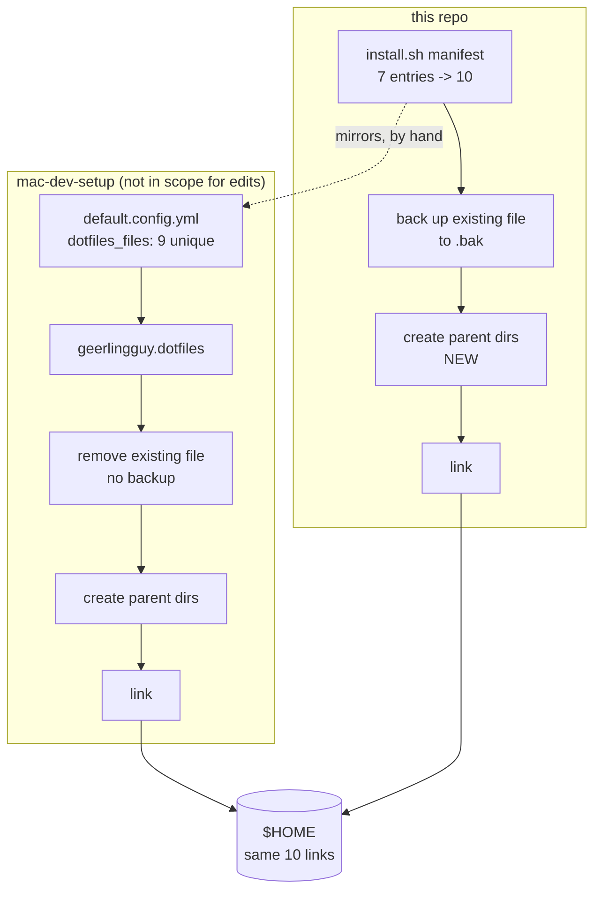

## Context

See [proposal.md — Why](proposal.md) for motivation.

The constraints that shape the approach:

- **The Ansible repository is not in scope for edits.** Whatever alignment happens, this
  repository does all of it. The external manifest is a fixed target.
- **The external installer is `geerlingguy.dotfiles`**, driven by `dotfiles_files` in
  `mac-dev-setup/default.config.yml`. Its list is ten entries, one of which
  (`.claude/CLAUDE.md`) appears twice — nine unique paths.
- **This repository's current list is a strict subset of that one.** All seven entries in
  `LINK_FILES` appear in `dotfiles_files`. Alignment is therefore purely additive: three entries
  to add, nothing to remove or rename.
- **The tracked inventory is small and fully enumerable.** Nine dotfiles at the repository root,
  two below it (`.claude/CLAUDE.md` and `.github/workflows/ci.yml`). After alignment the
  manifest holds ten and the exclusion list holds exactly one.
- **The two installers have opposite semantics on a pre-existing real file.** `install.sh` backs
  it up to `<name>.bak` and refuses to clobber an existing backup. The Ansible role removes it
  outright (`state: absent`) before linking. See Decisions.
- **The Ansible role already solves nested paths**, with an explicit step that ensures the parent
  directory of each link exists before linking. `install.sh` has no equivalent.
- **`dotfiles_repo_local_destination` defaults to `~/.dotfiles`**, but no such directory exists
  on the author's machine — the live links resolve into the working copy at `~/Projects/dotfiles`
  instead, so the deployment overrides that variable locally. Both installers operate on the same
  checkout.

## The two install paths

The dotted edge is the whole design problem. The two manifests must agree, and after this change
nothing checks that they do — see Decisions.

## Goals / Non-Goals

**Goals:**

- A standalone clone plus one command yields the same links as a full Ansible provision.
- The accounting check covers every tracked dotfile, not only those at the repository root.
- The installer is discoverable as an installer.
- A reader who finds the manifest can tell it mirrors something and find what.

**Non-Goals:**

- **Changing anything in `mac-dev-setup`.** Ruled out by the constraint, including the duplicate
  `.claude/CLAUDE.md` entry, which is harmless.
- **Making the standalone path install software.** Homebrew packages, `zimfw`, `fnm`, `rbenv`,
  and the casks are declared in `homebrew_installed_packages` in the Ansible repository, and that
  stays the only place they are declared. "Same `$HOME`" here means the same links, not the same
  machine.
- **Automated drift detection between the two repositories.** Considered and rejected — see
  Decisions.
- **Reconciling the backup-versus-delete difference.** Also a decision, below.

## Decisions

### The installer moves to the repository root as `install.sh`

A standalone user clones the repository and needs to find the thing that installs it. `tests/` is
where the test suite lives, and the README currently sends new machines into it, which reads as a
mistake even though it works.

*Alternative considered:* `bin/install` or `script/bootstrap`, following the "scripts to rule them
all" convention. Rejected as premature — that convention earns its keep when there are several
scripts with a shared entry-point discipline. There is one script.

*Consequence:* three references to update (`README.md`, `tests/invariants.bats` in two places,
`.github/workflows/ci.yml`), plus `tests/bootstrap.bats`, which invokes it.

### The manifest mirrors `dotfiles_files` and says so, but nothing enforces it

The manifest gains a comment naming `mac-dev-setup/default.config.yml` as the list it mirrors, so
the coupling is discoverable from the file that depends on it. Keeping them in step is a manual
act.

*Alternative considered:* a CI job that fetches the Ansible repository's `default.config.yml` and
fails when the two lists disagree. It would catch drift the day it happens, and reading that repo
does not violate the not-in-scope constraint. Rejected deliberately: it makes this repository's CI
fail because of a commit in a different repository, which is a confusing signal for a personal
dotfiles repo, and it introduces a network dependency into a check that otherwise needs none.

*Consequence:* the two lists will drift eventually, and the spec says so plainly rather than
pretending otherwise. The mitigation is that divergence is cheap to detect by hand — both lists are
ten lines — and cheap to fix.

### `.gitignore` is installed, and the old reason for excluding it was wrong

`.gitconfig` sets `excludesfile = ~/.gitignore`. That is git's global ignore file, not a
repository-local one. The existing exclusion reason — "applies to the repository itself" — reads
the filename rather than the configuration that points at it.

The failure mode this creates is the quiet kind: git does not warn about a missing excludes file,
it just behaves as though the file were empty. A standalone install would produce a machine where
global ignore rules silently do nothing, and nothing in the test suite would notice, because no
test asserts that global ignores work.

*Alternative considered:* keep the exclusion and drop `excludesfile` from `.gitconfig` instead.
Rejected — it removes a working feature to preserve a mistaken exclusion, and diverges further
from the Ansible path rather than converging.

### `.osx` is linked but still never executed

Linking a script into `$HOME` and running it are unrelated acts. The existing prohibition —
"System-mutating scripts stay untouched" — is about execution, and it is untouched by this change.
Ansible links `.osx`, so converging means linking it too.

The spec gains an explicit scenario for this, because "the macOS defaults script is linked" and
"the macOS defaults script is never run" sitting in the same document looks like a contradiction
until it is spelled out.

### The backup-versus-delete difference stays

`install.sh` preserves a pre-existing real file as `<name>.bak`; the Ansible role deletes it. The
`dotfiles-bootstrap` spec has an explicit requirement that pre-existing user files are never
destroyed, and that requirement is not weakened here.

"Same `$HOME`" is a claim about which links end up existing, not about how each tool treats a file
that was already sitting at the target path. Matching Ansible's behaviour would mean deleting a
requirement to imitate a third-party role, which is the wrong direction.

*Consequence:* a documented, accepted divergence. It is only observable on a machine that had real
files at those paths before either installer ran — which, on a fresh machine, is nothing.

### Nested linking creates parent directories, mirroring the role's approach

The Ansible role ensures each link's parent directory exists before linking. The installer does
the same, applied per entry rather than as a separate pass, so a manifest entry containing a slash
works without special-casing.

*Alternative considered:* linking the `.claude` directory itself rather than the file inside it.
Rejected — `~/.claude` holds live local state (settings, agents, sessions) that must not be
replaced by a link into this repository. Only the single tracked file is managed.

## Risks / Trade-offs

**Three new links land in a live `$HOME`** → On the author's machine all three already exist as
links to the same repository files, so the installer's existing "unchanged" path applies and
nothing is touched. The risk is on a machine where one of those paths holds a real file, where the
backup path applies and produces a `.bak`. Verified by running the installer against a sandbox
home directory before running it for real.

**`~/.claude/` is live, shared state** → Linking `.claude/CLAUDE.md` means creating `~/.claude/` if
absent, in a directory that also holds settings and local state this repository does not manage.
The installer creates the directory and links exactly one file inside it, never the directory
itself.

**The manifests will drift** → Accepted, deliberately, with no automated detection. The spec
states the consequence rather than hiding it, and the manifest comment gives a reader the pointer
they need to check.

**The move breaks references that are not obviously references** → `tests/invariants.bats` reads
the installer's *source text* with `sed` to extract its arrays, so it depends on the path and on
the array names. Both the path and the surrounding code change here, and that test must be updated
in step or it will silently pass on an empty extraction.

## Migration Plan

No deployment. On the author's machine the change is a no-op at install time, because every newly
managed path is already a correct link.

Ordering: the move lands before the manifest extension, so the accounting check and the tests are
pointing at the final path before their contents change.

Rollback is reverting the commits; no state outside the repository is modified that the installer
cannot reproduce.

## Open Questions

None.
